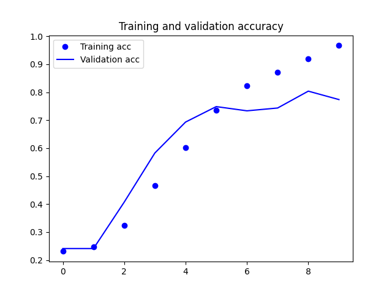
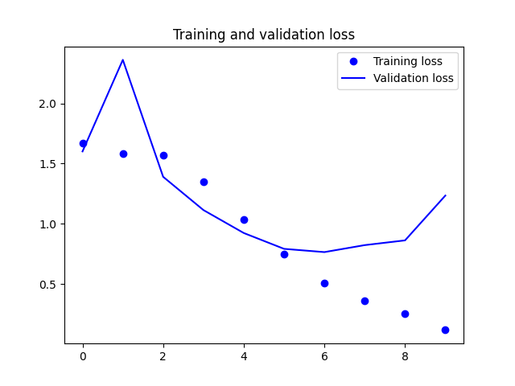
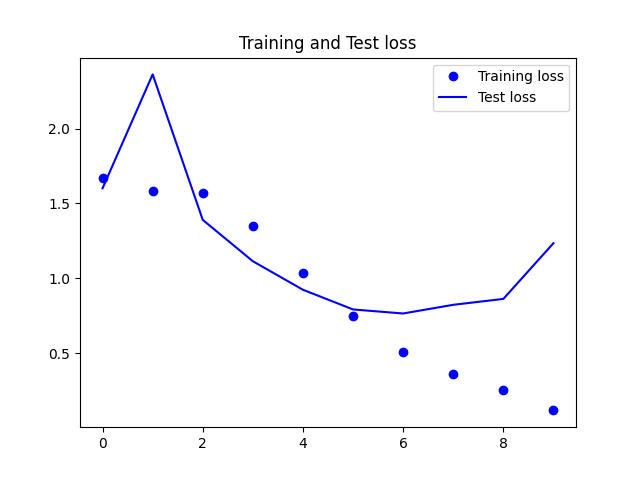

  <h2 align="center" style="margin-top: -4px !important;">Yoga Pose Prediction</h2>
  

    
    
  

	

- This repository contains the code/script to predict 5 types of Yoga poses namely downdog, goddess, plank, tree and warrior2.
- Dataset is available in the [link](https://github.com/dhhruv/Yoga-Pose-Prediction/releases/download/0.0/yoga.pose.dataset.zip).

### Tech Stack:

- Keras
- Matplotlib
- PIL

### Results:

	

 

	

 

	

 

	

 
